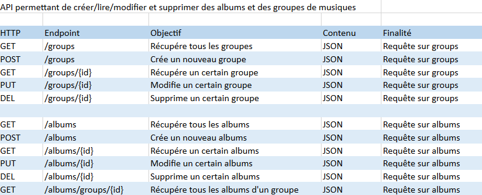
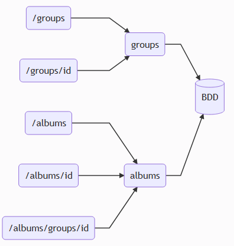

# Purpose
Node API allowing to create/read/update/delete music groups and albums details
# Quick start
Run the commands : 

`docker pull dutoitlouis/cybersecu-app`  
`docker run -p 4040:8080  dutoitlouis/cybersecu-app`

The app is now running on http://localhost:4040/
# Test
Import the `tests/API_test.json` in Insomnia/Postman or alike, every API route is called in it
# Analysis
- On utilise [Mongoose](https://www.npmjs.com/package/mongoose) pour gérer la connexion avec la BDD, cette dépendance peut être comparée à un ORM et permet de sécuriser notre application de manière pérenne.

- Les schemas [Mongoose](https://www.npmjs.com/package/mongoose) utilisés dans le dossier `/models` permettent d'imposer le type des éléments envoyés dans la base de données, cela mitige les injections mais selon le type envoyé il peut aussi être bon d'ajouter une bibliothèque comme [mongo-sanitize](https://www.npmjs.com/package/mongo-sanitize) pour permettre d'échapper tous les caractères d'instructions de MongoDB, pour tester cela on peut simplement essayer d'envoyer des requêtes malveillantes sur des tables de test et observer le résultat.

- Dans `config/db.js` on utilise la bibliothèque [dotenv](https://www.npmjs.com/package/dotenv) pour pouvoir utiliser des variables d'environnements dans un fichier `.env`, cela permet par exemple de stocker l'URI de connexion à la BDD sans le dévoiler, sans cela n'importe qui pourrait s'y connecter, la base étant hébergée, c'est le seul point d'entrée.

- La base de donnée est hébergée sur le service cloud de MongoDB : [Atlas](https://www.mongodb.com/cloud/atlas), ce service est sécurisé au travers d'un compte admin, une liste d'ip peut être configurée pour en limiter l'accés.

- Pour limiter les DOS, on peut limiter la taille maximale du contenu du payload et bloquer un utilisateur pendant un certain temps s'il fait trop de requêtes grâce à [express-rate-limit](https://www.npmjs.com/package/express-rate-limit).

- [express-validator](https://www.npmjs.com/package/express-validator) permet de limiter les XSS en vérifiant les données envoyées, par exemple le contenu d'un formulaire de connexion, on pourrait aussi utiliser des regex pour valider les données.

- On peut aussi utiliser [Helmet](https://helmetjs.github.io/) pour sécuriser les headers HTTP, on peut par exemple supprimer `x-powered-by` pour ne pas divulguer notre middleware.

- Pour gérer les [cookies](https://expressjs.com/en/advanced/best-practice-security.html#use-cookies-securely), Express recommande d'utiliser [express-session](https://www.npmjs.com/package/express-session) et [cookie-session](https://www.npmjs.com/package/cookie-session), cela remplace les anciennes dépeandances pour gérer les sessions, cela permet par exemple de n'envoyer les cookies qu'au travers d'une connexion HTTPS.

- Pour les dépendances `npm audit` permet de vérifier toutes les dépendances du projet et de rechercher les vulnérabilités connues, il y a aussi `Depandabot` sur le repo pour surveiller les dépendances et proposer des mises à jour automatiques.

- Il n'y a pas de systèmes de gestion de comptes, mais un système comme OAuth 2.0 serait à privilégier pour avoir un bon niveau de sécuritié.

# Security
Attack surface :  

  

Schema :  

  

Objectives : 

Confidentialité : Une fuite de données n'est pas très grave dans ce cas, sauf si l'album posté est censé rester secret, il n'y a pas de données personnelles stockées dans la base. (1/5)

Intégrité : Les données sont sauvegardées périodiquement, si elles sont modifiées on pourra donc les restaurer mais si la sauvegarde est trop ancienne on peut perdre certaines données. (1/5)

Disponiblité : Le service proposé par l'API n'est pas un service essentiel, sa coupure n'aura pas un énorme impact, sauf pour les quelques personnes mécontentes qui essaieront de l'utiliser, de plus les données sont stockées en utilisant le service cloud de MongoDB (Atlas), elles sont répliquées sur trois nodes pour assurer une disponibilité maximale (1/5)

Traçabilité : Les données n'étant pas essentielles, savoir d'où viennent les appels API n'est pas primordial, les logs sont tout de même stockés dans MongoDB. (1/5)

# Stack
Node.JS with Express.JS and MongoDB
# Author
Louis DUTOIT
